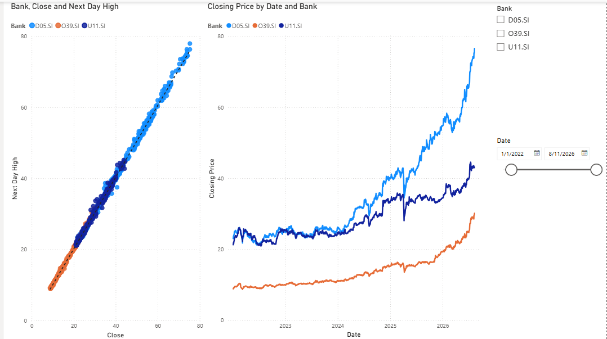

## Singapore Banks Stock Analysis

Analyzed 5 years of stock data for DBS, OCBC, and UOB using Python, SQL, and Power BI.

- Answered 4 business questions on volatility, liquidity, market peaks, and recovery speed.
- Built an interactive 4-page Power BI dashboard.
- [View on GitHub] (https://github.com/Salguod310/singapore-banks-stock-analysis)

---

## Quantitative Pairs Trading Strategy (In Progress)

Built a pairs trading backtest for SingTel (Z74.SI) and CapitaLand Integrated Commercial Trust (C38U.SI).

- Screened 66 pairs using the Engle-Granger cointegration test (best pair: p = 0.000229).
- Built a custom backtester with hedge ratio (0.2684) and transaction costs (0.1%).
- Currently adding Random Forest ML to predict spread direction.
- *GitHub link coming soon.*
